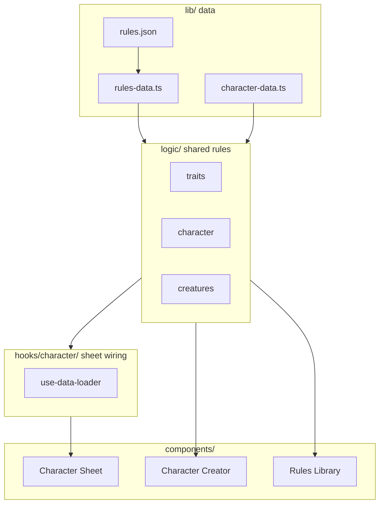

# Corian Forge documentation

Corian Forge is a static Next.js character sheet, creator, and rules library for the Corian tabletop RPG. This folder is the **architecture and contributor reference** for the codebase.

## Who should read what

| Document | Audience | Contents |
|----------|----------|----------|
| [architecture-overview.md](./architecture-overview.md) | Anyone new to the repo | App modes, layer model, hydration pipeline, rules access, folder map |
| [data-model.md](./data-model.md) | Contributors changing saves or rules | Save vs hydrated vs derived, ref types, hydration phases, aliases, validation |
| [contributor-guide.md](./contributor-guide.md) | Feature authors | Step-by-step: classes, actions, creatures, trait effects; module reference |
| [rules-json-authoring.md](./rules-json-authoring.md) | Rules / content authors | Detailed `rules.json` field reference, charges, passives, bestiary |
| [folder-structure.md](./folder-structure.md) | Contributors | Where to put data, logic, hooks, UI, and tests |
| [testing.md](./testing.md) | Contributors | Vitest, Playwright, rules validation in CI |

## `lib/` at a glance

Phase 5 removed ~42 compatibility shims. **`lib/` is data and types only** (eight files). Full inventory: [data-model.md — lib/ inventory](./data-model.md#lib-inventory-data-and-types-only).

| File | Import when you need… |
|------|------------------------|
| `rules-data.ts` | `rulesData`, `getClassRule`, `RulesRoot` |
| `rules.ts` | `Trait`, `ActionCard`, `TraitEffect`, … |
| `character-data.ts` | `CharacterSaveData`, save defaults (not stat functions) |
| `baseRefs.ts` | `TraitRef`, `ActionRef`, `ReactionRef` |
| `HydratedChar.ts` | `HydratedCharacter` |
| `equipment-data.ts` | `InventoryItem`, `Equipment` types |
| `utils.ts` | `cn()` |

Stat math, traits, creatures, and equip rules → **`logic/`**.

## Quick start

```bash
npm install
npm run dev              # development server
npm run build            # static export build
npx tsc --noEmit         # typecheck
npm run test:run         # unit + component tests
npm run validate:rules   # rules.json structural check
```

After editing [`lib/rules.json`](../lib/rules.json), run all three checks above and smoke-test **Creator**, **Sheet**, and **Library** tabs.

## How the app is organized



| Path | Role |
|------|------|
| [`lib/`](../lib/) | **8 files:** `rules.json` + seven TypeScript modules (types, save schema, rules accessors) — no logic shims |
| [`logic/`](../logic/) | Shared calculations (traits, stats, equipment, creatures, …) |
| [`hooks/character/`](../hooks/character/) | Sheet persistence and hydration orchestration |
| [`components/character-sheet/`](../components/character-sheet/) | Play-mode UI |
| [`components/character-creator/`](../components/character-creator/) | Character builder + creator-only logic |
| [`components/library/`](../components/library/) | Rules browser |
| [`tests/`](../tests/) | Tests mirroring source layout |

**Layering:** `components/` → `hooks/character/` → `logic/` → `lib/`. Creator imports `logic/` directly, not sheet hooks.

## App modes

One page ([`app/page.tsx`](../app/page.tsx)) hosts three surfaces. All read game content from `rulesData`; sheet and creator share `CharacterSaveData`.

| Mode | Persistence | Hydration |
|------|-------------|-----------|
| **Sheet** | `localStorage` + JSON import | `useDataLoader(rulesData)` |
| **Creator** | In-memory until export | `logic/` modules in steps + review |
| **Library** | None (read-only) | Display helpers in `logic/display/` |

## Persistence

- **Sheet:** auto-saves to `localStorage` (`corian-forge.character.v1`) via [`hooks/character/use-character-io.tsx`](../hooks/character/use-character-io.tsx).
- **Import / export:** JSON file; creator export does **not** automatically load into the sheet.
- **Derived stats** (defense, modifiers, resistances) are computed at runtime in [`logic/character/derived-stats.ts`](../logic/character/derived-stats.ts) — never stored in save JSON.

## Maintainer notes

Refactor plan (Phases T, O, 0–5 complete): [`.cursor/plans/cleanup-roadmap.plan.md`](../.cursor/plans/cleanup-roadmap.plan.md)

**Phase 5** deleted all `lib/` re-export shims and moved `EQUIPMENT_RULES` to `logic/equipment/equipment-slot-state.ts`. Stat helpers import from `@/logic/character/stats`, not `@/lib/character-data`.

Remaining deprecated paths (hooks/sheet only — not under `lib/`):

- `hooks/CharacterLoader.tsx` → `@/hooks/character/use-character-io`
- `hooks/ItemLoader.tsx` → `@/hooks/character/use-item-hydration`
- `components/character-sheet/hooks/DataLoader.tsx` → `@/hooks/character/use-data-loader`

Prefer canonical paths in new code.
