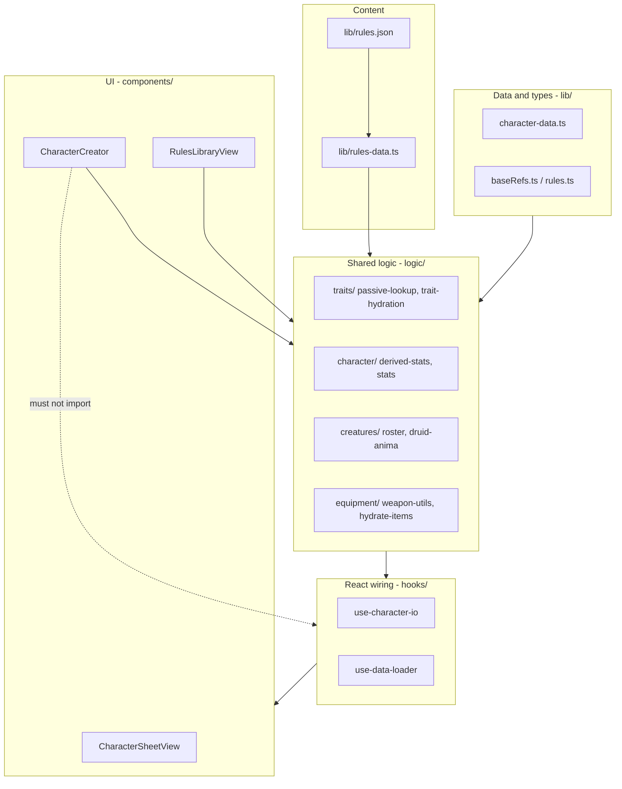
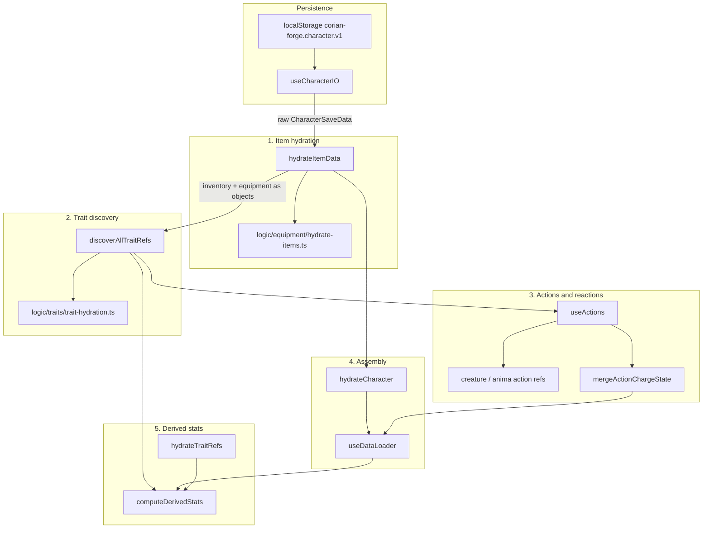
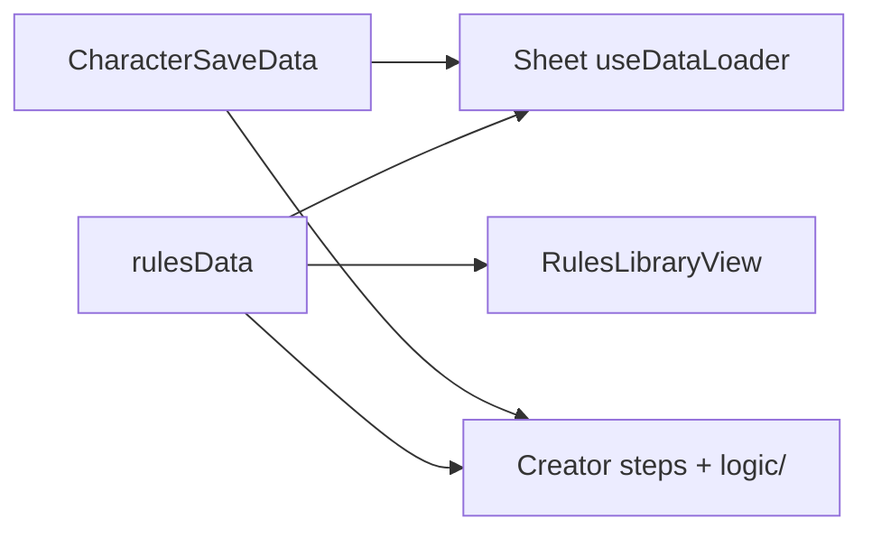

# Architecture overview

## What this app is

Corian Forge is a **static Next.js SPA** (`output: 'export'` in Next config). There is no backend. All game content ships in [`lib/rules.json`](../lib/rules.json); character state lives in the browser (`localStorage` + JSON import/export).

The entry point [`app/page.tsx`](../app/page.tsx) toggles three modes on one page:

1. **Character Sheet** — play mode: combat, inventory, traits, creatures
2. **Character Creator** — guided build and JSON export
3. **Rules Library** — read-only browse of classes, feats, items, glossary

Views stay mounted when switching tabs so in-memory state survives mode changes; a full page refresh restores the sheet from `localStorage`.

---

## Layer model



### Dependency direction

```
components/  →  hooks/character/  →  logic/<domain>/  →  lib/
```

| Layer | Location | Responsibility |
|-------|----------|----------------|
| **Content** | `lib/rules.json` | All game data: classes, feats, items, bestiary, system config |
| **Rules access** | `lib/rules-data.ts` | Typed `RulesRoot`, `rulesData` singleton, section getters — **only supported import path for rules in app code** |
| **Data & types** | `lib/` | Save schema (`CharacterSaveData`), ref types, item shapes, hydration result types |
| **Shared logic** | `logic/<domain>/` | Pure calculations used by creator, sheet, and library |
| **React wiring** | `hooks/character/` | Persistence, memoization, orchestration — no duplicated game rules |
| **UI** | `components/` | Layout, interaction, display |

### Design principles

1. **`logic/` owns game rules**; components own layout and interaction.
2. **One resolver per concept** — passive lookup (`resolvePassiveById`), trait discovery (`discoverAllTraitRefs`), derived stats (`computeDerivedStats`), action hydrate (`hydrateActionCardById`).
3. **Save stores refs; runtime hydrates** — never persist derived stats in save JSON.
4. **`rules.json` changes** require updating [rules-json-authoring.md](./rules-json-authoring.md), running `npm run validate:rules`, `npm run test:run`, and `npx tsc --noEmit`.
5. **No cross-surface imports** — the creator must not import sheet hooks; both import `logic/`.
6. **Import `@/lib/rules-data`**, not `@/lib/rules.json`, in application code.

---

## Rules access layer

All runtime code should read rules through [`lib/rules-data.ts`](../lib/rules-data.ts):

```typescript
import { rulesData, getClassRule, getActionCard } from "@/lib/rules-data"
import type { RulesRoot } from "@/lib/rules-data"
```

| Export | Purpose |
|--------|---------|
| `rulesData` | Bundled singleton cast to `RulesRoot` |
| `getRulesSystem`, `getRulesClasses`, `getClassRule`, … | Typed section accessors |
| `RulesRoot`, `ClassRule`, `FeatRule`, … | Pragmatic TypeScript shapes for JSON |

Hooks such as `useDataLoader(rulesData: RulesRoot)` take the full bundle. Domain modules that need narrower bestiary typing (e.g. creature roster) cast internally: `rules as RulesWithBestiary`.

### Validation and aliases

| Module | Role |
|--------|------|
| [`logic/rules/validate-rules.ts`](../logic/rules/validate-rules.ts) | Structural checks + legacy key detection |
| [`logic/rules/normalize-aliases.ts`](../logic/rules/normalize-aliases.ts) | `statBonus` → `statBonuses[]`, creature `traits` → `traitRefs` |
| [`scripts/validate-rules.mjs`](../scripts/validate-rules.mjs) | CLI used in CI and `npm run validate:rules` |
| [`scripts/migrate-rules-aliases.mjs`](../scripts/migrate-rules-aliases.mjs) | One-time / maintenance migration for bundled JSON |

Bundled `rules.json` uses canonical keys. Runtime still normalizes legacy aliases for older exports. See [data-model.md](./data-model.md#schema-aliases).

---

## Hydration pipeline

A character save (`CharacterSaveData`) stores **thin references** (`TraitRef`, `ActionRef`, equipment UIDs). At runtime the sheet resolves those against `rules.json` and produces display-ready state.



### Step-by-step

| Step | Entry point | What happens |
|------|-------------|--------------|
| **1. Load save** | [`hooks/character/use-character-io.tsx`](../hooks/character/use-character-io.tsx) | Read/write `localStorage`; import/export JSON; debounced auto-save |
| **2. Hydrate items** | [`hooks/character/use-item-hydration.tsx`](../hooks/character/use-item-hydration.tsx) → [`logic/equipment/hydrate-items.ts`](../logic/equipment/hydrate-items.ts) | Resolve inventory UIDs and equipment slot UIDs to full `InventoryItem` / weapon / armor objects from `rules.items` |
| **3. Discover traits** | [`discoverAllTraitRefs`](../logic/traits/trait-hydration.ts) | Merge character `traits[]`, racial innates, equipped item traits, invention module passives into `DiscoveredTraitRef[]` |
| **4. Resolve passives** | [`resolvePassiveById`](../logic/traits/passive-lookup.ts) | Look up each trait id in registries (global → class → race → feat → item → deity) |
| **5. Build actions** | [`hooks/character/use-action-cards.tsx`](../hooks/character/use-action-cards.tsx) | Merge class actions, equipment, `GrantActionCard` trait grants, deployed creatures, druid anima forms |
| **6. Charge state** | [`logic/traits/charge-helpers.ts`](../logic/traits/charge-helpers.ts) | Merge saved `ActionRef.charges` with rules max/reset |
| **7. Reactions** | `hydrateCharacter` in [`use-data-loader.tsx`](../hooks/character/use-data-loader.tsx) | Map `ReactionRef[]` → full `Reaction[]` via `buildReactionLibrary` |
| **8. Orchestration** | [`useDataLoader`](../hooks/character/use-data-loader.tsx) | Wires the above; exposes assembled character + `traitRefs` + UIDs for active slots |
| **9. Derived stats** | [`computeDerivedStats`](../logic/character/derived-stats.ts) in [`useDataLoader`](../hooks/character/use-data-loader.tsx) | Attributes, defense, stability, speed, resistances, languages, skill grants, druid anima overrides |

**Creator** uses the same `logic/` modules for review and validation (e.g. `computeDerivedStats`, `resolvePassiveById`) but does **not** call `useDataLoader`.

**Sheet UI** consumes `{ character, derived }` from `useDataLoader`. A legacy re-export remains at `components/character-sheet/hooks/DataLoader.tsx` for older import paths.

---

## Folder guide

### `app/`

Next.js layout and the single home page. No game logic.

### `lib/` — data, types, rules bundle

```
lib/
  rules.json
  rules-data.ts
  rules.ts
  character-data.ts
  baseRefs.ts
  HydratedChar.ts
  equipment-data.ts    # types only
  utils.ts
```

Equip slot updates: [`logic/equipment/equipment-slot-state.ts`](../logic/equipment/equipment-slot-state.ts). Stat calculations: [`logic/character/stats.ts`](../logic/character/stats.ts). Do not add new logic under `lib/`.

| File | Role |
|------|------|
| `rules.json` | Bundled game content |
| `rules-data.ts` | Typed accessors — **only supported way to read rules in app code** |
| `rules.ts` | Entity types shared across surfaces |
| `character-data.ts` | Save schema, defaults, stat-related **type** aliases (not stat functions) |
| `baseRefs.ts` | Ref types for save JSON |
| `HydratedChar.ts` | Hydrated character type |
| `equipment-data.ts` | Item and slot **types** only |
| `utils.ts` | UI helpers (`cn`) |

Phase 5 removed ~42 `@deprecated` re-export files that previously mirrored `logic/`. If an old `@/lib/foo` import fails, use the matching module under `logic/` (see [data-model.md](./data-model.md#lib-inventory-data-and-types-only)).

### `logic/` — shared calculations

Domain subfolders (non-exhaustive):

| Folder | Examples |
|--------|----------|
| `traits/` | `passive-lookup`, `trait-hydration`, `trait-refs`, `selection`, `charge-helpers` |
| `character/` | `derived-stats`, `stats`, `bonds` |
| `actions/` | `hydrate`, `tag-utils`, `embedded-action-card` |
| `equipment/` | `weapon-utils`, `hydrate-items`, `equipment-slot-state`, `proficiency`, `natural-weapons` |
| `creatures/` | `roster`, `druid-anima`, `fairy-tamer`, `mounted-creature`, `rider-mounts` |
| `combat/` | `more-info`, `damage-resolution`, `power-roll-combat-bonuses` |
| `feats/` | `prereqs`, `sort` |
| `classes/` | `class-options`, `priest-deities`, `occupation` |
| `display/` | `rules-library-helpers`, `glossary-lookup`, formatting |
| `rules/` | `validate-rules`, `normalize-aliases` |

### `hooks/character/` — sheet runtime wiring

| Hook | Role |
|------|------|
| `use-character-io.tsx` | Persistence, import/export |
| `use-item-hydration.tsx` | Item + equipment hydration |
| `use-data-loader.tsx` | Full pipeline orchestration |
| `use-action-cards.tsx` | Action card discovery and filtering |

Top-level [`hooks/CharacterLoader.tsx`](../hooks/CharacterLoader.tsx), [`ItemLoader.tsx`](../hooks/ItemLoader.tsx), [`ActionCardLoader.tsx`](../hooks/ActionCardLoader.tsx) are deprecated re-exports of the above.

### `components/character-sheet/`

Play-mode UI by tab:

- `combatPage/` — attributes, actions, focus, resource bars
- `characterPage/` — traits, proficiencies, creatures; `panels/` for tracking sub-panels
- `trackingPage/` — inventory (`inventory/` subfolder), equipment

`hooks/` under the sheet only re-exports from `hooks/character/`.

### `components/character-creator/`

Multi-step wizard. Creator-only logic lives in `components/character-creator/logic/` (`import.ts`, `todos.ts`, `class-selection-helpers.ts`). Class-specific pickers: `steps/class-archetypes/`.

### `components/library/`

`RulesLibraryView.tsx` — rules browser. Heavy formatting helpers live in `logic/display/rules-library-helpers.tsx`.

### `tests/`

Mirrors source layout under `tests/logic/`, `tests/components/`, `tests/e2e/`. See [testing.md](./testing.md).

---

## Persistence model

| Mechanism | Key / format | Notes |
|-----------|--------------|-------|
| Auto-save | `localStorage` key `corian-forge.character.v1` | Debounced ~300ms via `useCharacterIO` |
| Import | User picks JSON file | Sanitizes bonds, ensures roster fields |
| Export | Download JSON | Creator export is separate from sheet state |
| Rules | Bundled at build time | `import { rulesData } from '@/lib/rules-data'` |

Bump `CHARACTER_STORAGE_KEY` in `use-character-io` if the save shape changes incompatibly.

---

## Three surfaces, one rules bundle



| Surface | Reads rules via | Reads/writes save |
|---------|-----------------|-------------------|
| Sheet | `useDataLoader(rulesData)` | Yes — `localStorage` + import |
| Creator | `rulesData` getters in steps | Builds in memory; export only |
| Library | `rulesData` + display helpers | No |

---

## Related docs

| Doc | Contents |
|-----|----------|
| [data-model.md](./data-model.md) | Save schema, ref types, entity graph, aliases |
| [folder-structure.md](./folder-structure.md) | Where to put new code |
| [contributor-guide.md](./contributor-guide.md) | How to add classes, actions, creatures |
| [testing.md](./testing.md) | Vitest, Playwright, `validate:rules` |
| [rules-json-authoring.md](./rules-json-authoring.md) | Field-level `rules.json` reference |

Maintainer refactor history: [`.cursor/plans/cleanup-roadmap.plan.md`](../.cursor/plans/cleanup-roadmap.plan.md) (Phases T, O, 0–5 complete).

### Import cheat sheet

| You need | Import |
|----------|--------|
| Rules content | `@/lib/rules-data` |
| Save shape | `@/lib/character-data` |
| Item types | `@/lib/equipment-data` |
| Attribute modifiers, max HP, class bonuses | `@/logic/character/stats` |
| Defense, resistances, full derived blob | `@/logic/character/derived-stats` |
| Equip drag rules | `@/logic/equipment/equipment-slot-state` |
| Traits / passives | `@/logic/traits/*` |
