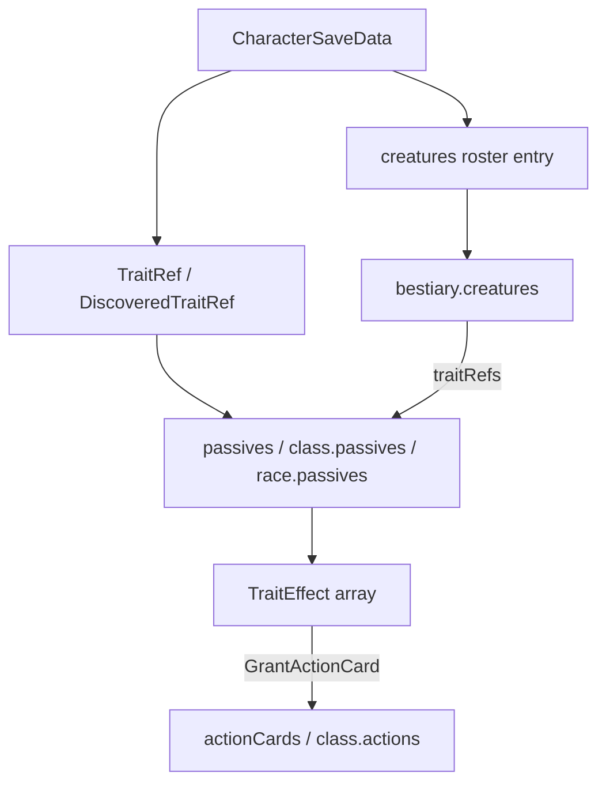

# Data model

How character saves, rules content, and runtime hydration relate. For field-level `rules.json` authoring, see [rules-json-authoring.md](./rules-json-authoring.md). For the full pipeline diagram, see [architecture-overview.md](./architecture-overview.md#hydration-pipeline).

---

## `lib/` inventory (data and types only)

After Phase 5, `lib/` contains **eight files** — no re-export shims. Game logic lives under `logic/`.

| File | Purpose |
|------|---------|
| `rules.json` | Bundled game content |
| `rules-data.ts` | `RulesRoot`, `rulesData`, typed section getters — **import rules here** |
| `rules.ts` | Shared entity types (`Trait`, `ActionCard`, `TraitEffect`, …) |
| `character-data.ts` | `CharacterSaveData`, defaults, save-related type aliases (`ClassBonusRule`, …) |
| `baseRefs.ts` | `TraitRef`, `ActionRef`, `ReactionRef` |
| `HydratedChar.ts` | `HydratedCharacter` |
| `equipment-data.ts` | Item and equipment **slot types** only (`InventoryItem`, `Equipment`, …) |
| `utils.ts` | Small UI helpers (`cn`) |

**Not in `lib/` (common mistakes):**

| Need | Import from |
|------|-------------|
| Stat math (`getAttributeModifier`, `computeMaxHP`, `sumClassStatBonus`, …) | `@/logic/character/stats` |
| Derived totals (defense, resistances, languages) | `@/logic/character/derived-stats` |
| Equip/unequip slot rules (two-hand, shield swap) | `@/logic/equipment/equipment-slot-state` |
| Trait/passive resolution | `@/logic/traits/*` |
| Creator import/todos | `@/components/character-creator/logic/*` |

---

## Two representations: save vs runtime

| Representation | Type | Where defined | Contains |
|----------------|------|---------------|----------|
| **Save** | `CharacterSaveData` | [`lib/character-data.ts`](../lib/character-data.ts) | Refs, tallies, player choices — portable JSON |
| **Hydrated** | `HydratedCharacter` | [`lib/HydratedChar.ts`](../lib/HydratedChar.ts) | Resolved items, full action cards, full reactions |
| **Derived** | Return value of `computeDerivedStats` | [`logic/character/derived-stats.ts`](../logic/character/derived-stats.ts) | Max HP/MP, defense, resistances, trait list for UI — **never persisted** |

**Rule:** Never write derived stats (defense total, attribute modifiers, resistance lists) back into save JSON. Recompute on load via `computeDerivedStats`.

---

## Save schema (`CharacterSaveData`)

### Core fields

| Group | Fields | Notes |
|-------|--------|-------|
| Identity | `name`, `age`, `gender`, `race`, `profileImage`, `background`, `backstory` | |
| Classes | `classes: { id, level }[]` | Level per class id |
| Resources | `hp`, `barrier`, `mp`, `focus`, `respite` | Current values; max from derived stats |
| Attributes | `attributes` (five stats), `attributeLevelBonuses?` | Creator uses base scores + bonus map; export uses final scores |
| Progress | `xp`, `inspiration`, `victories`, `speed` | |
| Abilities | `traits`, `actions`, `reactions`, `focusFeatures`, `skills`, `actionLayout?` | Traits/actions/reactions are **refs**; `actionLayout` is player UI ordering/folders for the combat action list |
| Economy | `money`, `ip`, `inventory`, `containers`, `equipment` | Inventory entries use stable `uid`; equipment slots store **UIDs** |
| Social | `bondTargets`, `culture*`, `occupation` | Culture keys from `rules.system` |

### Extension fields (class-specific)

| Field | Class / feature | Purpose |
|-------|-----------------|---------|
| `priestDeity` | Priest | Filters deity talents in creator |
| `riderMountType`, `riderAdaptableMovement`, `mountedCreatureId` | Rider | Mount selection and combat state |
| `creatures` | Conjurer, Druid, feats | Roster of summons / anima forms |
| `conjurerSummonTemplateIds` | Conjurer | Creator slot picks → reconciled to `creatures` |
| `druidAnimaTemplateIds`, `activeDruidAnimaTemplateId`, `equipmentBeforeAnima`, `animaBarrierBonus` | Druid Anima | Transform state and gear stash |
| `fairyTamerContracts` | Fairy Tamer | Per-contract creature + spell picks |
| `specialInvention` | Artificer | Variant, modules, weapon infusion |
| `creatorSkillGrantPicks` | Creator only | Keyed skill grant picker state for re-import |
| `bondedWeaponUids` | Weapon Bond | Inventory UIDs marked bonded |
| `combatDefenseDelta`, `combatStabilityDelta`, `combatSpeedDelta` | Combat tab | Temporary combat modifiers |

### Ref types (`lib/baseRefs.ts`)

```typescript
interface TraitRef {
  id: string
  source: string
  selectedEffectIndices?: number[]  // when passive has selectAmount
  charges?: number                  // -1 = not tracked
}

interface ActionRef {
  id: string
  charges?: number
}

interface ReactionRef {
  id: string
  slotIndex: number
  charges?: number
}
```

On the save, the trait array field is always **`traits`** (not `traitRefs`). Creature **templates** in bestiary use **`traitRefs`**.

---

## Hydrated types

`HydratedCharacter` extends the save shape but replaces key fields:

| Save field | Hydrated field |
|------------|----------------|
| `inventory: InventoryEntry[]` | `inventory: InventoryItem[]` (merged with `rules.items`; optional `charges: { current, max }` snapshot when rules define charge tracking). Save: `inventory[].charges` (current count). |
| `equipment` (UID strings per slot) | `equipment` (resolved weapon / armor / misc objects) |
| `actions: ActionRef[]` | `actions: ActionCard[]` (equipment-granted cards include runtime `grantingItemUid`, `grantingItemName`, `instanceKey`; spend cost via rules `itemChargeCost` on the action card, charge pool on the item; `enhancements` overlay from active `EnhanceAction` traits — not persisted) |
| `actionLayout?: ActionLayout` | Same on save; drives combat tab folder/order UI (not rules JSON). See [`logic/actions/action-layout.ts`](../logic/actions/action-layout.ts). |
| `reactions: ReactionRef[]` | `reactions: Reaction[]` |

Runtime-only fields on the assembled sheet object (from `useDataLoader`, not necessarily on `HydratedCharacter` type):

- `traitRefs: DiscoveredTraitRef[]` — full discovery result before passive hydration
- `activeWeaponUid`, `offhandUid`, `activeArmorUid` — map back to save UIDs for UI highlighting
- `derived` sibling object — output of `computeDerivedStats` (defense, maxHP, resistances, …)

`DiscoveredTraitRef` extends `TraitRef` with optional `itemId` and `inlineDefinition` for equipment-embedded passives. Defined in [`logic/traits/trait-hydration.ts`](../logic/traits/trait-hydration.ts).

---

## Runtime hydration (detailed)

### Phase A — Item hydration

**Input:** raw `CharacterSaveData` (equipment slots are UIDs).  
**Module:** `hydrateItemData` → `logic/equipment/hydrate-items.ts`.  
**Output:** same save fields, but `inventory` entries and equipped slots contain merged item objects from `rules.items`.

Equipment on the save still uses UIDs until assembly completes. **Drag-to-equip** on the sheet applies slot rules via `EQUIPMENT_RULES` in [`logic/equipment/equipment-slot-state.ts`](../logic/equipment/equipment-slot-state.ts) (two-handers, shield swap, Shield Master).

### Phase B — Trait discovery

**Module:** `discoverAllTraitRefs(character, rulesData)`.

Sources merged into a deduped map (later entries can enrich earlier ones):

1. Racial innates — `rules.races[race].passives` where `type === "innate"`
2. Character `traits[]` — feats, class features, background picks
3. Equipped / worn inventory items — nested trait definitions on item rows
4. Artificer invention modules — passive ids from module config

Output: `DiscoveredTraitRef[]` (not yet full `Trait` objects).

### Phase C — Passive resolution

**Module:** `resolvePassiveById(traitId, rules, context?)` in [`logic/traits/passive-lookup.ts`](../logic/traits/passive-lookup.ts).

Lookup order (first match wins):

1. `passives.<id>`
2. `classes.*.passives.<id>` (any class on character)
3. `races.*.passives.<id>`
4. `races.*.selectableTraits.<id>`
5. `system.feats.<id>`
6. Item-nested traits (via `traitRef.itemId` + inventory)
7. Priest deity overlay (deity-specific passives)

Context can supply `traitRef.inlineDefinition` for traits defined only on an item row.

### Phase D — Trait hydration (for stats)

**Module:** `hydrateTraitRefs(traitRefs, character, rulesData)`.

Merges rule data + save ref (`selectedEffectIndices`, `charges`), runs `resolveTraitEffectsAfterSelection`, produces full `Trait[]` for effect application.

### Phase E — Action discovery

**Module:** `useActions` + creature helpers from `logic/creatures/roster.ts`.

Action ids collected from:

- Character `actions[]` refs
- Class proficiencies and known actions
- Equipped weapons / items
- `GrantActionCard` effects on discovered traits
- Deployed conjurer / companion creatures
- Active druid anima template

Charge counts merged via `mergeActionChargeState` (`logic/traits/charge-helpers.ts`).

Hydrated traits from `hydrateTraitRefs(discoverAllTraitRefs(...))` feed `applyActionEnhancements` (`logic/actions/action-enhancements.ts`), which attaches runtime `ActionCard.enhancements` overlays (description appendices, summed cost/tier deltas). Not saved on the character JSON.

### Phase F — Derived stats

**Module:** `computeDerivedStats(character, rulesData)`.

Uses hydrated traits, equipped gear, class stat bonuses (`logic/character/stats.ts`), druid anima template overrides, mount bonuses, and combat-more-info collectors. Returns numeric totals and UI metadata (`statHighlights`, `activeTraits`, `languages`, …).

---

## `rules.json` topology

| Top-level key | Purpose |
|---------------|---------|
| `system` | Feats, skills, languages, XP, bonds, occupations, item ranks, default reactions |
| `classes` | Per-class passives, actions, reactions, focus feats, `statBonuses[]`, class options |
| `races` | Racial passives and selectable traits |
| `items` | Equipment catalog |
| `actionCards` | Shared actions/reactions (equipment, feats, fairies, …) |
| `passives` | Standalone passives (e.g. invention modules) |
| `bestiary` | Creature templates (`creatures`) and creature-only traits (`traits`) |
| `glossary` | Effect dictionary for Library tooltips |

### Reading rules in code

```typescript
import { rulesData, getClassRule, getActionCard } from "@/lib/rules-data"
import type { RulesRoot } from "@/lib/rules-data"
```

Do **not** import `@/lib/rules.json` in application code. Accessors live in [`lib/rules-data.ts`](../lib/rules-data.ts). Shared entity types (`Trait`, `ActionCard`, `TraitEffect`) live in [`lib/rules.ts`](../lib/rules.ts).

---

## Entity relationships



| From | To | Link |
|------|-----|------|
| Character `traits[]` | Passive definition | `TraitRef.id` → `resolvePassiveById` |
| Passive `effects` | Action card | `GrantActionCard` → `getActionCard(id)` |
| Character `actions[]` | Action card | `ActionRef.id` → `hydrateActionCardById` |
| `creatures[]` | Bestiary template | `templateId` → `bestiary.creatures[id]` |
| Creature template | Traits | `traitRefs[]` → passive ids |
| Equipment UID | Item trait | Nested traits on `rules.items[id]` |

---

## Schema aliases

Historical naming variants. **Bundled `rules.json` uses canonical keys.** Runtime still normalizes legacy shapes for old JSON.

| Canonical | Legacy alias | Normalization |
|-----------|--------------|---------------|
| `statBonuses[]` on class rules | `statBonus` object | `normalizeClassStatBonuses`, `migrateClassRuleAliases` |
| `skillTrainings[]` | `skillTraining` object | `normalizeClassSkillTrainings` |
| `traitRefs[]` on creature templates | `traits[]` string array | `normalizeCreatureTraitRefs`, `getCreatureTemplates` |
| `traits[]` on character save | — | Always `traits`; never rename to `traitRefs` |

| Module | Role |
|--------|------|
| [`logic/rules/normalize-aliases.ts`](../logic/rules/normalize-aliases.ts) | Read-time normalization + migration helpers |
| [`logic/rules/validate-rules.ts`](../logic/rules/validate-rules.ts) | Errors if legacy keys appear in bundled JSON |
| [`scripts/migrate-rules-aliases.mjs`](../scripts/migrate-rules-aliases.mjs) | Rewrite bundled JSON to canonical keys |
| [`scripts/validate-rules.mjs`](../scripts/validate-rules.mjs) | CI / `npm run validate:rules` |

---

## `TraitEffect` semantics

Defined in [`lib/rules.ts`](../lib/rules.ts). Interpreted in [`logic/traits/selection.ts`](../logic/traits/selection.ts) and applied in [`logic/character/derived-stats.ts`](../logic/character/derived-stats.ts).

| `type` | `stat` | `value` |
|--------|--------|---------|
| `StatChange` | Attribute or derived stat id | Numeric delta or formula key |
| `AttributeChange` | Attribute id | Bonus amount |
| `Resistance` / `Vulnerability` / `Immunity` | Damage type id | Often omitted for Immunity |
| `GrantMovement` | Movement mode | Speed or rule key |
| `GrantSight` | Sense type | — |
| `GrantActionCard` | — | Action card id |
| `EnhanceAction` | — | Target `actionId`; optional `appendDescription`, cost/tier deltas |
| `Language` | Language id | — |
| `GrantSkill` | — | See `GrantSkillEffect` |
| `SummonSchool` | School id | Conjurer unlock |

Some effects use `when` for conditional application (e.g. dual-wielding for Cross Block).

---

## Typed boundaries

| Area | Type | Notes |
|------|------|-------|
| Save JSON | `CharacterSaveData` | `@/lib/character-data` — schema and defaults only |
| Item types | `InventoryItem`, `Equipment` | `@/lib/equipment-data` — types only |
| Stat calculations | functions in `logic/character/stats.ts` | **Not** re-exported from `character-data.ts` |
| Rules bundle | `RulesRoot` + accessors | `@/lib/rules-data` |
| Trait discovery | `DiscoveredTraitRef`, `TraitDiscoverySource` | `logic/traits/trait-hydration.ts` |
| Sheet orchestration | `useDataLoader(rulesData: RulesRoot)` | Character object is save + hydrated merge |
| Derived stats input | Loosely typed character object | Save/hydrated hybrid at runtime; rules param is `RulesRoot` |
| Validation | `RulesValidationIssue[]` | `validateRulesDocument` / `validateRulesRoot` |

---

## ID conventions

- **camelCase** stable ids: `weaponBond`, `improvedManaFlow`, `equipment/jab`
- Renaming an id **breaks** existing saves that reference it
- Class actions: key under `classes.<classId>.actions`
- Global action cards: slash paths when shared: `equipment/stab`, `feat/bite`

Full conventions: [rules-json-authoring.md](./rules-json-authoring.md#id-conventions).
