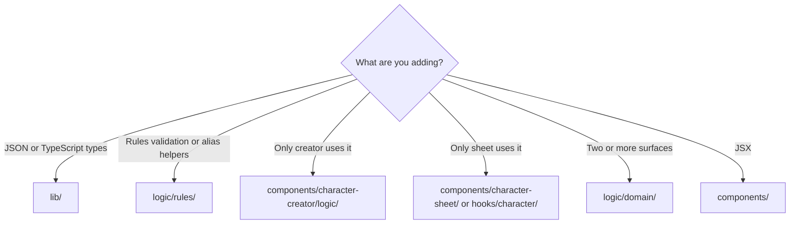

# Folder structure

Where code belongs in Corian Forge after the logic/ refactor (see [architecture-overview.md](./architecture-overview.md)).

## Decision tree



| Question | Put it here |
|----------|-------------|
| Static rules content, save interfaces, item types? | [`lib/`](../lib/) |
| Typed access to `rules.json`? | [`lib/rules-data.ts`](../lib/rules-data.ts) |
| Creator import, todos, creator-only validation? | [`components/character-creator/logic/`](../components/character-creator/logic/) |
| React wiring (`useState`, loaders, memo)? | [`hooks/character/`](../hooks/character/) |
| Shared calculations (creator + sheet + library)? | [`logic/<domain>/`](../logic/) |
| Layout, buttons, panels? | [`components/`](../components/) |
| Unit / component / E2E tests? | [`tests/`](../tests/) mirroring source path |

**Do not** put game logic in `lib/`. **Do not** import `hooks/character/` from the creator — use `logic/` for shared behavior. **Do not** import `@/lib/rules.json` in app code — use `@/lib/rules-data`.

---

## `lib/` — data, types, rules bundle

```
lib/
  rules.json
  rules-data.ts
  rules.ts
  character-data.ts
  baseRefs.ts
  HydratedChar.ts
  equipment-data.ts    # item / slot types only
  utils.ts
```

| File | What belongs here |
|------|-------------------|
| `rules.json` | All game content JSON |
| `rules-data.ts` | `RulesRoot`, getters, `rulesData` singleton |
| `rules.ts` | Shared TypeScript types for rules entities |
| `character-data.ts` | `CharacterSaveData`, defaults, save-related type aliases |
| `baseRefs.ts` | Ref types stored in save JSON |
| `HydratedChar.ts` | Post-hydration character type |
| `equipment-data.ts` | Item union types, `Equipment` slot shape — **no** equip logic |
| `utils.ts` | Generic UI helpers |

**Phase 5:** deleted ~42 `@deprecated` files that re-exported `logic/` modules. Old `@/lib/charge-helpers`-style paths **no longer exist** — use `@/logic/...` directly.

**Stat functions** (`getAttributeModifier`, `computeMaxHP`, …) live in [`logic/character/stats.ts`](../logic/character/stats.ts), not in `character-data.ts`.

**Equip slot rules** (`EQUIPMENT_RULES`) live in [`logic/equipment/equipment-slot-state.ts`](../logic/equipment/equipment-slot-state.ts).

---

## `logic/` — shared calculations

One top-level folder; domain subfolders inside:

```
logic/
  traits/       charge-helpers, passive-lookup, trait-hydration, trait-refs, selection, …
  character/    derived-stats, stats, bonds
  actions/      hydrate, tag-utils, embedded-action-card
  equipment/    weapon-utils, hydrate-items, equipment-slot-state, proficiency, …
  combat/       more-info, damage-resolution, power-roll-combat-bonuses, …
  creatures/    roster, druid-anima, fairy-tamer, mounted-creature, rider-mounts
  feats/        prereqs, sort
  classes/      class-options, priest-deities, occupation
  display/      rules-library-helpers, glossary-lookup, formatting
  rules/        validate-rules, normalize-aliases
```

Import example: `@/logic/traits/charge-helpers`

`logic/` must not import from `components/` or `hooks/`.

---

## `hooks/character/` — sheet runtime wiring

```
hooks/character/
  use-character-io.tsx      # localStorage, import/export
  use-item-hydration.tsx    # wraps logic/equipment/hydrate-items
  use-data-loader.tsx       # full hydration orchestration
  use-derived-stats.tsx     # memo wrapper over computeDerivedStats
  use-action-cards.tsx      # action discovery
```

Deprecated top-level aliases (re-export the above):

- `hooks/CharacterLoader.tsx` → `use-character-io`
- `hooks/ItemLoader.tsx` → `use-item-hydration`
- `hooks/ActionCardLoader.tsx` → `use-action-cards`

Sheet-local deprecated aliases:

- `components/character-sheet/hooks/DataLoader.tsx` → `use-data-loader`
- `components/character-sheet/hooks/statCalculator.tsx` → `use-derived-stats`

---

## Surface-specific UI

```
components/character-creator/
  logic/                    import.ts, todos.ts, class-selection-helpers.ts
  steps/
    class-archetypes/       Druid / Conjurer / Artificer pickers
  ClassOptionPicker.tsx
  CharacterCreator.tsx

components/character-sheet/
  characterPage/panels/     tracking tab sub-panels (barrel: tracking-panel.tsx)
  trackingPage/inventory/   inventory-utils, display context, draggable row
  combatPage/               attributes, actions, resource bars
  CharacterSheetView.tsx

components/library/
  RulesLibraryView.tsx      display; helpers in logic/display/

components/equipment/       shared equipment UI widgets
```

---

## `tests/` — mirrors source layout

All tests live under [`tests/`](../tests/), not next to production code:

```
tests/
  logic/traits/           charge-helpers.test.ts, passive-lookup.test.ts, …
  logic/rules/              normalize-aliases.test.ts, rules-document.test.ts
  lib/                      rules-data.test.ts
  components/               component tests (jsdom)
  e2e/                      Playwright specs
```

Example mapping:

| Source | Test |
|--------|------|
| `logic/traits/charge-helpers.ts` | `tests/logic/traits/charge-helpers.test.ts` |
| `lib/rules-data.ts` | `tests/lib/rules-data.test.ts` |
| Bundled `rules.json` | `tests/logic/rules/rules-document.test.ts` |

See [testing.md](./testing.md).

---

## Layering

```
components/  →  hooks/character/  →  logic/  →  lib/
```

- `logic/` must not import from `components/` or `hooks/`.
- `lib/` must not import from `components/` or `hooks/`. `character-data.ts` may import **types only** from `logic/` for save schema fields.
- Creator and Library may import `logic/` and `lib/` directly; Creator must not import `hooks/character/`.

---

## Scripts (maintenance)

| Script | Purpose |
|--------|---------|
| [`scripts/validate-rules.mjs`](../scripts/validate-rules.mjs) | Structural validation; run via `npm run validate:rules` |
| [`scripts/migrate-rules-aliases.mjs`](../scripts/migrate-rules-aliases.mjs) | Migrate legacy keys in bundled `rules.json` |

---

## Related docs

- [architecture-overview.md](./architecture-overview.md) — hydration pipeline, three surfaces
- [data-model.md](./data-model.md) — save vs hydrated vs derived
- [contributor-guide.md](./contributor-guide.md) — how to extend content
- [`.cursor/plans/cleanup-roadmap.plan.md`](../.cursor/plans/cleanup-roadmap.plan.md) — refactor history (Phases T, O, 0–5 complete)
